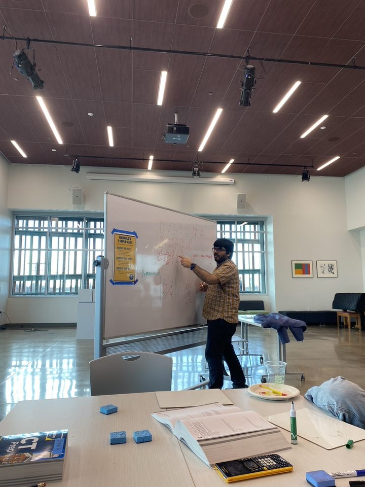
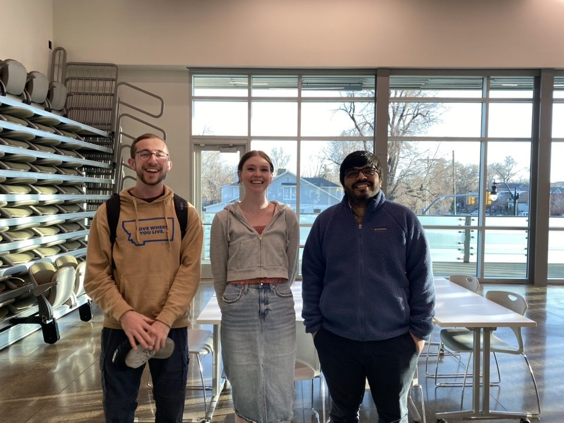

BACKGROUND
------
I was born and brought up in Delhi, India. I studied at Indira Ideal Sr. Sec. School, Janak Puri. I completed my bachelors from [Ambedkar Institute of Advanced Communication Technologies and Research](https://aiactr.ac.in/) which is affiliated with [Guru Gobind Singh Indraprastha University](https://www.ipu.ac.in/). After my bachelors, I enrolled in Master of Technology Program in [Electtrical Engineering](https://www.ee.iitb.ac.in/web) Department at [IIT Bombay](https://www.iitb.ac.in/), India. I worked with [Prof. Ashish Vanmali, VCET(a PhD candidate at that time)](https://vcet.edu.in/departments/information-technology-engineering/ashish-vanmali/) and [Prof. V.M. Gadre, EE, IIT](https://www.ee.iitb.ac.in/wiki/faculty/vmgadre) while at IIT. After my Graduation, I worked in Cadence Design Systems IP Group(Formerly Tensilica) as a Lead Design Engineer.

READING
-------
I read a decent amount of fiction, fantasy or political books every year. You can use the link below to find some books which you might like.
[My GoodReads Acount](https://www.goodreads.com/user/show/16894718-tushaar-kataria)

VOLUNTEERING EXPERIENCE
------

- **ACT Volunteer Tutor, Bennion Center, University of Utah, (Current- Sep 2022)** : Helping students with Maths and Science at one of the Public Libraries in Salt Lake City with other amazing volunteers.

- **Social Responsibility Group, Cadence Designs System, Pune (Dec 2020 -July 2017)** : As a part of the social outreach program, I actively participated in selecting causes to assist, such as flood relief, care facilities for mentally challenged adults, care homes for adults with intellectual disabilities, and science education in rural areas. Volunteering for social outreach projects, creating new events centered around causes, promoting employee involvement, and other duties are also responsibilities.

- **Volunteering for Leadership Development with Tech4Team in Collaboration with W.I.T.U., Uganda (Oct 2019- July 2019)**: Part of team of 10 Cadence employees who went to Uganda to work with a local non-profit called Women in Technology, Uganda. We helped in building their first maker space, train their teachers on how to use 3D printing, virtual reality, electronics(BBC Microbit) and help in improving their entrepreneurship program. 

   [My Experience Post ](https://www.linkedin.com/pulse/volunteering-experience-cadencecares-team4tech-witu-uganda-kataria/)

   Others:[ Angad Kumar Baranwal ](https://www.linkedin.com/feed/update/urn:li:activity:6585603044325584896/), [ Nick Heaton ](https://www.linkedin.com/pulse/mollys-tale-nick-heaton/?trackingId=mFDTPQwEYAlFF0Ya9PMEBg%3D%3D), [ Guna Pivora ](https://www.linkedin.com/pulse/she-needed-hero-so-thats-what-became-guna-pivora/?trackingId=WkwfzVTaadGXRVSkzNBnWg%3D%3D)

- **Ed Support Volunteer, MAD (Feb 2020-Dec 2017)**: Taught Maths and English to orphanage students enrolled in diploma programs at university.

- **Volunteer Teacher, Abhyasika (July 2017-Aug 2014)** : Weekly English and Math tutoring for students from economically disadvantaged families. 

